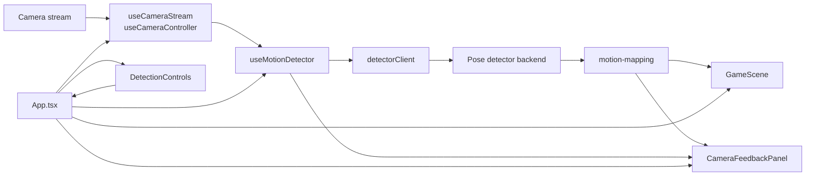
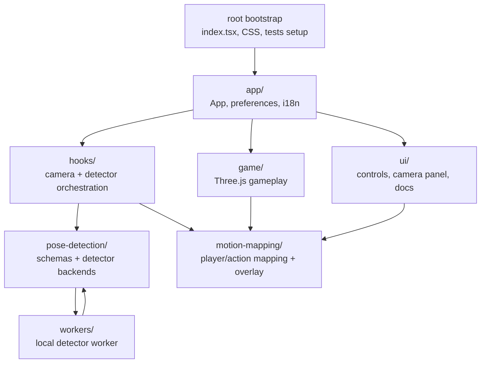
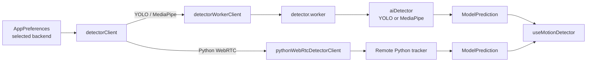
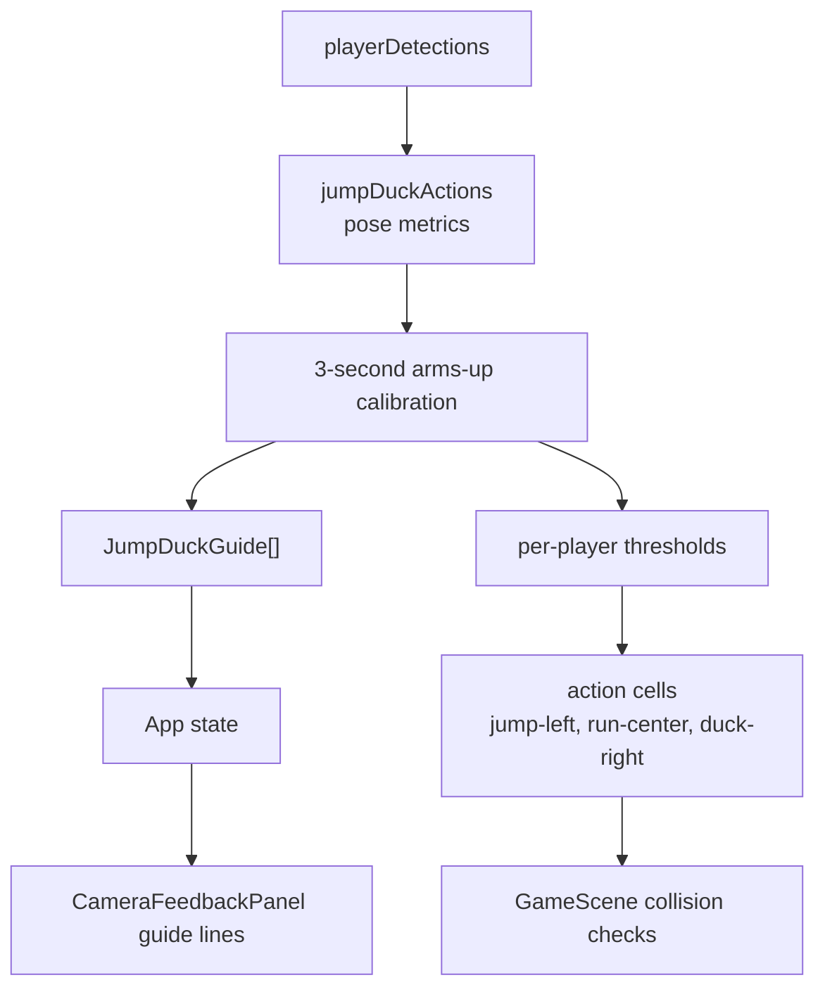

# Frontend Architecture

The frontend is a React/Vite motion-controlled runner game. It captures camera frames, runs person/pose detection, maps detections into player state, and renders a Three.js game scene plus camera/debug controls.

## High-Level Flow



`frontend/src/app/App.tsx` is the composition root. It owns app preferences, the current game phase, and the calibration guide state shown on the camera preview. It wires the camera hooks, detector hook, game scene, camera feedback panel, and detector controls together.

## Source Layout

- `frontend/src/app/`
  - App-level wiring, persisted preferences, and i18n.
  - `App.tsx` composes the running app.
  - `appPreferences.ts` reads/writes detector, camera, threshold, and player preferences from `localStorage`.
  - `i18n.tsx` provides Spanish/English translations and language persistence.

- `frontend/src/hooks/`
  - React hooks for browser/camera state and detector orchestration.
  - `useCameraStream.ts` owns `getUserMedia`, camera device discovery, video/canvas refs, and optional developer camera multiplication.
  - `useCameraController.ts` applies preferences to the stream and restarts the camera when camera-related settings change.
  - `useMotionDetector.ts` owns the detection loop, model loading/reset, player assignment, frame timings, and detector status.

- `frontend/src/pose-detection/`
  - Detector contracts and backend implementations.
  - `detectionSchema.ts` defines the shared frame, detection, keypoint, and prediction types.
  - `aiDetector.ts` loads and decodes YOLO and MediaPipe detectors.
  - `detectorClient.ts` chooses the right client path for the selected backend.
  - `pythonWebRtcDetectorClient.ts` connects to the remote Python/WebRTC tracker.

- `frontend/src/workers/`
  - Worker entrypoint and browser-side worker client.
  - `detectorWorkerClient.ts` sends frames to the worker using `ImageBitmap` transfer.
  - `detector.worker.ts` loads YOLO/MediaPipe detector code off the main thread and returns prediction results.

- `frontend/src/motion-mapping/`
  - Converts detections into gameplay-friendly signals.
  - `playerPositions.ts` normalizes player counts and maps detections to stable horizontal player positions.
  - `poseOverlay.ts` draws boxes, skeletons, IDs, and confidence labels on the camera overlay.
  - `jumpDuckActions.ts` handles jump/duck calibration, guide line positions, and per-player action cells such as `jump-left` or `run-center`.

- `frontend/src/game/`
  - Three.js runner scene and gameplay rules.
  - `GameScene.tsx` renders players, tracks, obstacles, HUD, game mode selection, collisions, and jump/duck calibration flow.

- `frontend/src/ui/`
  - React UI outside the Three.js scene.
  - `CameraFeedbackPanel.tsx` renders the camera preview, overlay canvases, player markers, and jump/duck/side calibration guide lines.
  - `DetectionControls.tsx` renders camera, backend, model, language, threshold, player-count, and diagnostics controls.
  - `TrackingInternalsDocs.tsx` renders the internal tracking documentation route.

Root-level files are bootstrapping or shared presentation assets: `index.tsx`, `index.css`, `App.css`, `setupTests.ts`, `reportWebVitals.ts`, `vite-env.d.ts`, and `logo.svg`.



## Runtime Responsibilities

`App.tsx` coordinates state without doing low-level camera or detector work. Preference changes flow from `DetectionControls` into `App`, and `App` decides whether the detector must reset. Game start/pause/stop actions also flow through `App`.

Camera ownership is split intentionally:

- `useCameraStream` owns raw browser media APIs and canvas sizing.
- `useCameraController` translates stored preferences into camera operations.
- `CameraFeedbackPanel` only renders the current refs and visual guides.

Detection ownership is also split:

- `useMotionDetector` controls when frames are captured and how results update React state.
- `detectorClient` selects local worker detection or remote WebRTC detection.
- `aiDetector` and `pythonWebRtcDetectorClient` know backend-specific loading and result formats.
- `detectionSchema` is the shared boundary between those layers.

Motion mapping sits between detection and gameplay. This keeps detector output generic while giving the game simple inputs:

- `playerPositions`: normalized horizontal positions from `0` to `1`.
- `playerDetections`: per-player detections used by the game for pose animation and jump/duck action classification.
- `jumpDuckActions`: calibrated action cells and guide lines for the obstacle game.

## Detector Modes

The detector can run in two modes:

- Pull mode: `useMotionDetector` captures a frame from the video/canvas loop and awaits a result. YOLO and MediaPipe use this path through the worker.
- Stream mode: the backend pushes results asynchronously. Python WebRTC uses this path, and `useMotionDetector` listens through the `onResult` callback.

Both modes emit the same `ModelPrediction` shape, so downstream player assignment, overlays, and game logic do not need backend-specific branches.



## Game Interaction

`GameScene` receives:

- `playerPositions` for the classic sideways runner.
- `playerDetections` for pose animation and jump/duck/side classification.
- `phase` and start/pause callbacks from `App`.

The jump/duck game calibrates each player by sampling pose metrics while arms are raised. Those samples become per-player thresholds for:

- jumping: eyes above the calibrated jump line
- ducking: eyes below the calibrated duck line
- side movement: face center beyond calibrated shoulder-side thresholds

`GameScene` sends `JumpDuckGuide[]` back to `App`, and `App` passes those guides into `CameraFeedbackPanel` so players can see the active thresholds over the camera preview.



## Persistence

The frontend persists small user preferences in `localStorage`:

- detector/camera/player preferences in `appPreferences.ts`
- selected language in `i18n.tsx`
- selected game mode in `GameScene.tsx`

Stored values are validated or clamped before use so stale values fall back to safe defaults.

## Testing And Verification

Tests live next to the modules they cover:

- `app/App.test.tsx`
- `pose-detection/aiDetector.test.ts`
- `motion-mapping/poseOverlay.test.ts`

For behavior changes, run:

```bash
pnpm test
pnpm build
pnpm lint
```

For UI/gameplay changes, also start the app with:

```bash
pnpm start
```

Then manually verify camera preview, player markers, MediaPipe detection, both game modes, and selected-level persistence.
