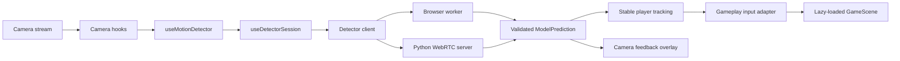
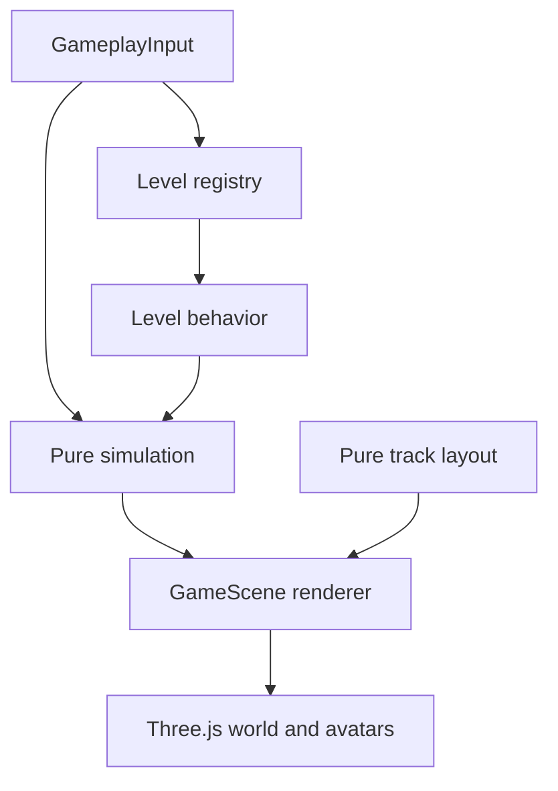

# System Architecture

Webcam Motion Games is a React/Vite motion game collection backed by browser or Python pose detection. The code is organized around explicit boundaries: detector output is validated at the transport edge, converted into detector-independent gameplay input, then consumed by deterministic game rules and a Three.js renderer.

## High-Level Flow



`frontend/src/app/App.tsx` is the frontend composition root. It owns preferences and app-level game phase, wires the camera and detector hooks to UI components, and lazy-loads the game and documentation route. Backend code and Three.js objects do not leak into app-level state.

## Frontend Boundaries

### App and preferences

`frontend/src/app/` contains composition, persistence, localization, and preference transitions.

- `App.tsx` connects hooks, controls, camera feedback, and gameplay.
- `appPreferences.ts` is the single persistence boundary for detector, camera, player-count, and selected-level preferences. Stored values are validated and merged with defaults.
- `appPreferencesReducer.ts` expresses preference changes as typed actions and derives the detector configuration key used to decide when a session must reset.
- `i18n.tsx` owns translated strings and language persistence.

### Camera and detector lifecycle

`frontend/src/hooks/` separates browser media ownership from detector ownership.

- `useCameraStream.ts` owns `getUserMedia`, device discovery, media refs, and canvas sizing.
- `useCameraController.ts` translates preference changes into camera operations.
- `useMotionDetector.ts` owns the camera-frame loop and converts predictions into UI/game state.
- `useDetectorSession.ts` owns detector creation, startup, replacement, failure, and disposal. Its lifecycle is tested independently of the frame loop.
- `motionDetectorHelpers.ts`, `motionDetectorTypes.ts`, and `detectorFrameScaling.ts` keep pure calculations and shared contracts outside React effects.

### Detection and transport protocol

`frontend/src/pose-detection/` contains detector-facing code only.

- `detectorClient.ts` selects a local worker or remote WebRTC implementation.
- `aiDetector.ts`, `detectorConfig.ts`, and `detectorDecoders.ts` load and decode browser YOLO/MediaPipe models.
- `pythonWebRtcDetectorClient.ts` implements the remote transport.
- `detectionSchema.ts` defines frontend detection types.
- `protocolValidation.ts` validates remote data before it enters application state.

The transport contract is versioned independently in `protocol/`:

- `model-prediction.schema.json` is the canonical JSON Schema.
- `model-prediction.fixture.json` is shared by frontend and Python contract tests.
- `protocolVersion` must match the supported version before a prediction is accepted.

MediaPipe must retain `numPoses: 2`; YOLO naturally returns multiple detections.

### Motion mapping and gameplay input

`frontend/src/motion-mapping/` is the anti-corruption layer between detectors and gameplay.

- `playerTracking.ts` assigns stable player tracks using pure functions and an injected clock.
- `playerPositions.ts` maps tracks to normalized horizontal positions from `0` to `1`.
- `gameplayInput.ts` converts detector records into the small, detector-independent input contract consumed by the game.
- `jumpDuckActions.ts` derives calibrated jump, duck, and side actions.
- `poseOverlay.ts` draws camera diagnostics without affecting gameplay state.

Camera mirroring is applied while assigning player positions, so both camera markers and gameplay receive the same orientation.

### Game domain and rendering

`frontend/src/game/` separates deterministic rules from Three.js side effects.

- `gameTypes.ts` defines the game-facing domain contract.
- `gameSimulation.ts` contains pure time, score, collision, and action transitions. Time and randomness are injected so tests are deterministic.
- `levelRegistry.ts` is the extension point for runner modes. It binds each level's metadata, detector task, movement policy, and labels.
- `levels/` contains behavior specific to sideways, jump/duck, and hand-rhythm modes.
- `trackLayout.ts` contains pure coordinate calculations and has no Three.js dependency.
- `trackWorld.ts`, `obstacles.ts`, and `playerAvatar.ts` own Three.js construction and disposal.
- `GameScene.tsx` coordinates rendering and delegates rules and level behavior to those modules.

Adding a runner mode should normally mean adding a level module and registry entry rather than adding another conditional branch throughout `GameScene` or `App`.



### UI

`frontend/src/ui/` contains presentation components outside the game canvas.

- `CameraFeedbackPanel.tsx` renders the preview, overlay, markers, and calibration guides.
- `DetectionControls.tsx` composes focused controls from `ui/detection-controls/`.
- `TrackingInternalsDocs.tsx` renders the documentation route.

The game scene and documentation page are lazy-loaded. This keeps Three.js out of the initial application bundle until gameplay is rendered.

## Python Tracker Server

`pose-estimation-tracker-server/src/pose_estimation_tracker_server/` follows the same separation of concerns:

- `server.py` is the composition and CLI entrypoint.
- `signaling.py` owns WebSocket offer/answer messaging.
- `webrtc_session.py` owns peer-connection and media-track lifecycle.
- `tracker.py` owns model loading and frame inference.
- `protocol.py` serializes the versioned prediction contract.
- `preview.py` provides the local preview command.

This split lets signaling, protocol serialization, and server coordination be tested without loading a real model or opening a real peer connection.

## Extension Guide

- New detector: implement the detector client contract, validate its output at the boundary, and register its preference metadata.
- New game mode: create a module under `game/levels/`, register it in `levelRegistry.ts`, and test the behavior without Three.js where possible.
- New persisted setting: add it to `AppPreferences`, validate it in `appPreferences.ts`, and model its transition in `appPreferencesReducer.ts`.
- Protocol change: increment the protocol version, update the schema and fixture, then update both frontend and Python validators/tests.

## Testing and Verification

Tests live beside frontend source as `*.test.ts` or `*.test.tsx`. Python tests live in `pose-estimation-tracker-server/tests/`, and browser smoke tests live in `frontend/e2e/`.

Run the normal gates from the repository root:

```bash
pnpm lint
pnpm test
pnpm build
pnpm lint:python
pnpm test:python
pnpm test:e2e
```

`pnpm verify` runs the static, unit, build, and Python gates. CI runs the same layers and installs Chromium for Playwright smoke coverage. For camera or gameplay changes, also run `pnpm start` and manually verify the preview, mirrored markers, supported player count, and game scene with suitable camera hardware.
